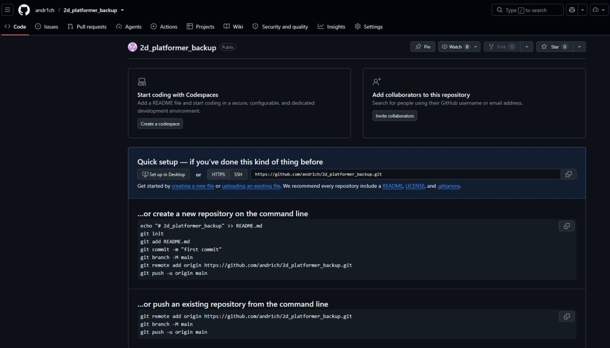
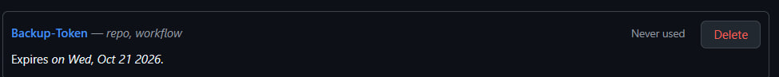
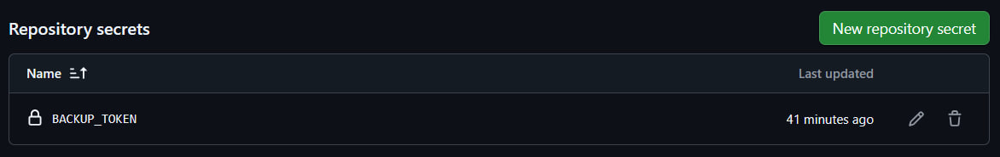
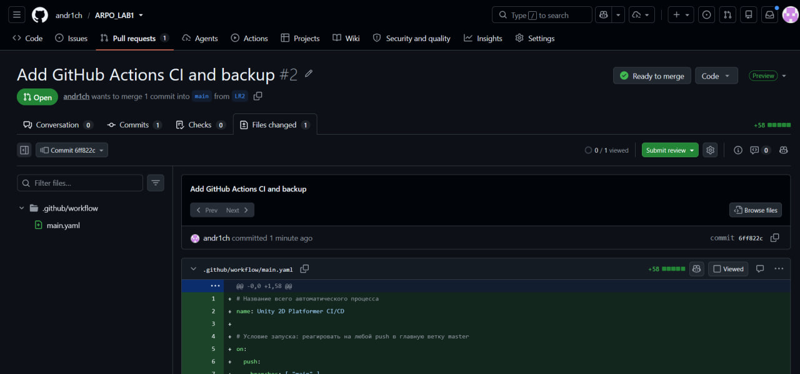
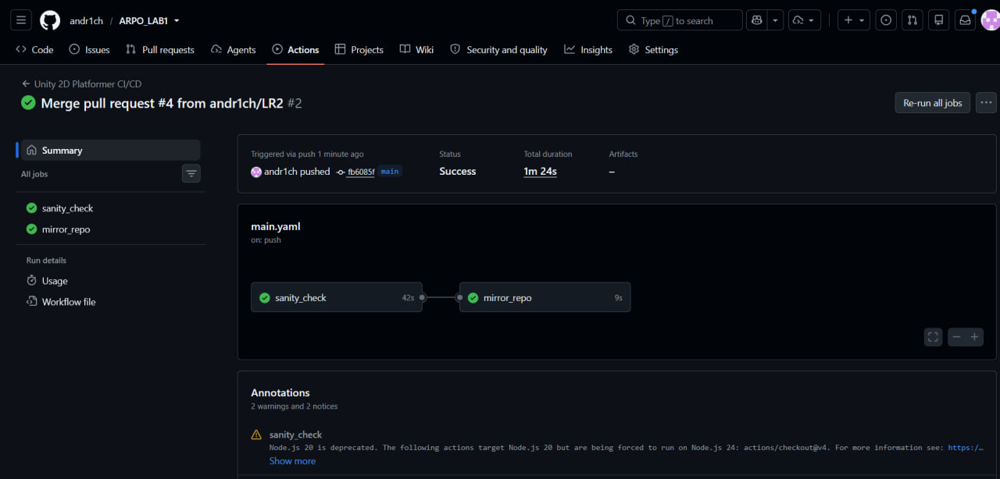
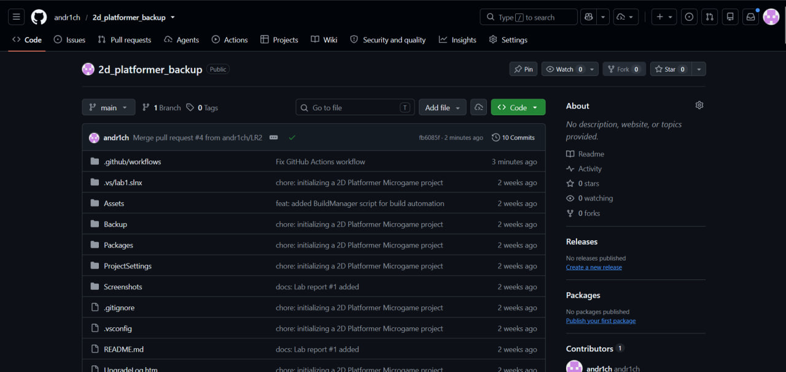

Шаг 1: Инициализация проекта
 

Шаг 2: Создание C# скрипта сборщика
 

Шаг 3: Отключение сжатия для WebGL (Критически важно для работы Live Server и запуска web проекта локально)
 

Шаг 4: Проверка скрипта через интерфейс Unity
 
 

 

Шаг 6: Анализ результатов и логов сборки
 
 

 

Шаг 7: Проверка работоспособности (Локальный запуск)

 
Шаг 8: Настройка Git и публикация

 
 
Шаг 9: Документирование, cоздание Pull Request и Peer Review
(Аппрувы)

Лабораторная 2

Шаг 1: Создание резервного репозитория для зеркалирования

Шаг 2: Генерация токена доступа (PAT Token)

Шаг 3: Сохранение токена в секреты основного проекта

Шаг 4: Написание единого YAML пайплайна

Шаг 5: Отправка пайплайна на GitHub

Шаг 6: Проверка результатов и отчет
